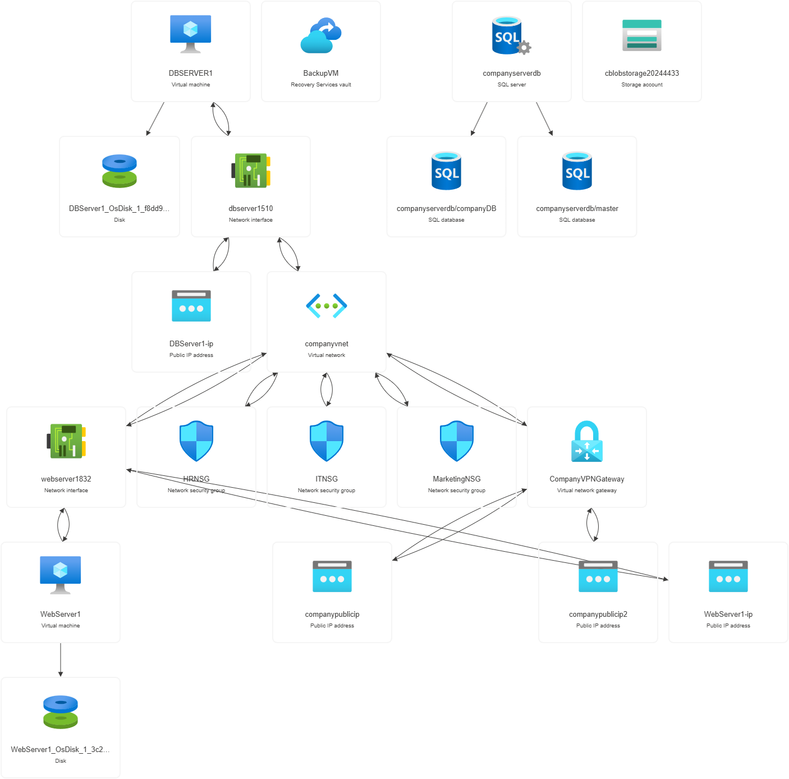

# 🚀 Comprehensive Azure Infrastructure Management 

## 📋 Table of Contents

- [Introduction](#introduction)
- [Technologies Used](#features)
- [Architecture](#architecture)
- [Summary](#summary)

## 🌟 Introduction

This project demonstrates the deployment and management of a comprehensive cloud infrastructure on Microsoft Azure. It covers all of the aspects of Azure Administration
including resource provisioning, networking, storage, database management, and security.

Before deploying any resource, I made sure it's cost optimized for my personal project.

## ✨ Features

Resources used:

+ Virtual Network & Subnets
+ Virtual Machines
+ Storage Accounts
+ Azure SQL Database
+ Microsoft Entra ID (Azure AD)

## 💻 Architecture

The project deploys the following resources on Azure:

+ Resource Group: A container that holds related resources for Azure solutions.
+ Virtual Network (VNet): A logically isolated network in Azure.
+ Subnets: Two subnets within the VNet.
+ Storage Accounts: For storing blobs with lifecycle management policies.
+ Azure SQL Database: A fully managed SQL database.
+ Microsoft Entra ID: For managing user access and permissions.




## ☁️ Step 1 - Virtual Network & Subnets

In this task, I have deployed Virtual Network and assigned subnets for each department. For example
in this case i assigned "ITSubnet", "MarketingSubnet", "HRSubnet". I used CLI to provide the resources.
I also provided the NSG (Network Security Group for each subnet to control the flow of internet traffic.)


After tasks above, the last objective was to Set up a VPN Gateway to allow secure remote access to Vnet.

## ☁️ Step 2 - Deploy and Configure Virtual Machines

In this task, I have deployed lowest cost Virtual Machines and did configure the following key properties:

```
Name: Webserver1
Image: Ubuntu
Size: Lowest Cost Available
Inboud port rules: Allow RDP (3389) or SSH (22) for remote access.
Virtual Network: "CompanyVnet"
Subnet: "ITSubnet"
Public IP: Created new one

```
I also created another virtual machine with the name "DBSever" and configured the same properties.
After this task, I secure traffic to and from VM's using Network Security Groups. I created a few
simple rules such as allow specific traffic "HTTP"...

After configuring the rules, I created a new vault for backup and did the configuration.
You can preview the following screenshot:


## ☁️ Step 3 - Set up and configure Storage Solutions

In this task, I have deployed two storage accounts with the lowest cost.
I did the configuration for "Lifecycle Management", for example:
If the files are not updated withing 90s, storage account will switch to Cool tier.


## ☁️ Step 4 - Configure and Secure Azure SQL Database

In this task, I have deployed Azure SQL Database and configured the prompted properties.
I also configured firewall rules and added virtual network to connect to my resource using service endpoints.


## ☁️ Step 5 - Set Up and Configure Microsoft Entra ID (formerly Azure AD)

In this task, I simply added a few users, created a few groups and assigned
a RBAC (Role-Based Access Control) to manage pemrisions and access to Azure resources.

## 🌟 Summary

This project provides a hands-on approach to deploying and managing Azure resources, 
focusing on essential aspects of Azure Administration.
